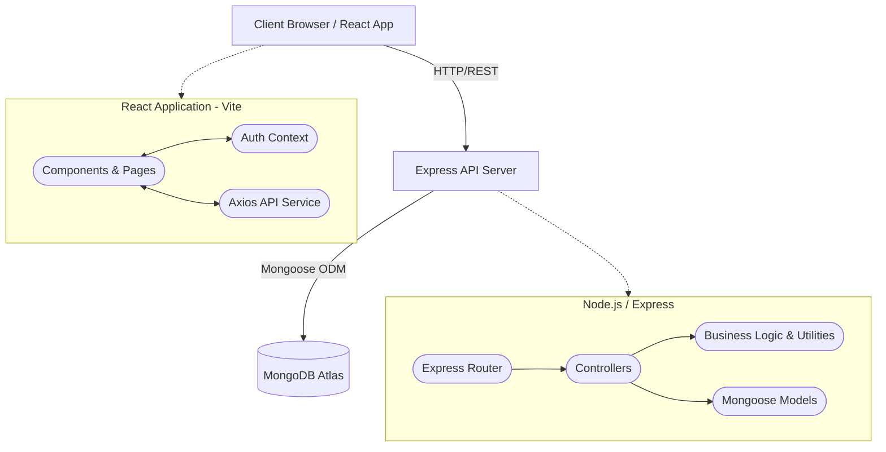
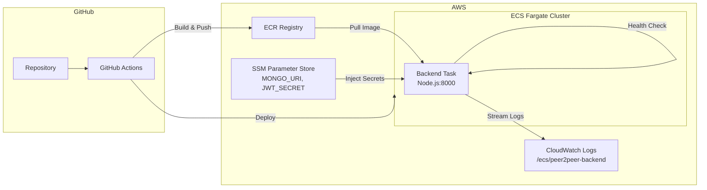

# System Architecture

## Overview
peer2peer is a Full-Stack application following a standard MERN (MongoDB, Express, React, Node.js) architecture. It utilizes a RESTful API approach for communication between the strictly decoupled frontend and backend. The application is deployed on **AWS ECS Fargate** with a fully automated CI/CD pipeline.

## High-Level Architecture

## Deployment Architecture (AWS)

## Component Roles

### Frontend (React + Vite)
- **State Management:** React Context API (`AuthContext`) manages user sessions comprehensively.
- **Routing:** `react-router-dom` handles page navigation and protects routes (e.g., creating a listing requires authentication).
- **Styling:** Custom CSS focusing on a clean, light, and minimalist user experience.
- **Production Serving:** Nginx serves the static build with SPA routing, gzip compression, and aggressive asset caching.

### Backend (Node.js + Express)
- **API Endpoints:** RESTful structured endpoints located under `/api/products`, `/api/auth`, `/api/upload`, and `/api/payments`.
- **Validation:** Enforced primarily through Mongoose schema validation.
- **Authentication:** JWT (JSON Web Tokens) are generated upon login/registration and validated via middleware (`authMiddleware.js`) for protected routes.
- **Storage:** Product images are handled via Multer and stored locally in the `/uploads` directory on the server.
- **Health Check:** `GET /` returns `"peer2peer API is running..."` — used by both Docker and ECS health checks.

### Database (MongoDB Atlas)
- **Schema-Based ODM:** Mongoose enforces relationships between Users and Products (One-to-Many).
- **Cloud-Hosted:** MongoDB Atlas provides a managed, scalable database accessible from ECS Fargate.

### CI/CD Pipeline
- **CI Gate:** Linting, testing, and frontend builds must pass before any deployment.
- **Docker:** Multi-stage Dockerfiles produce minimal production images.
- **ECR:** Docker images are tagged with both the Git commit SHA (traceability) and `latest` (convenience).
- **ECS Fargate:** Serverless container orchestration with rolling deployments — no EC2 instances to manage.
- **CloudWatch:** Centralized logging with 30-day retention for cost control.
- **SSM Parameter Store:** Application secrets are injected at runtime, never baked into images.
