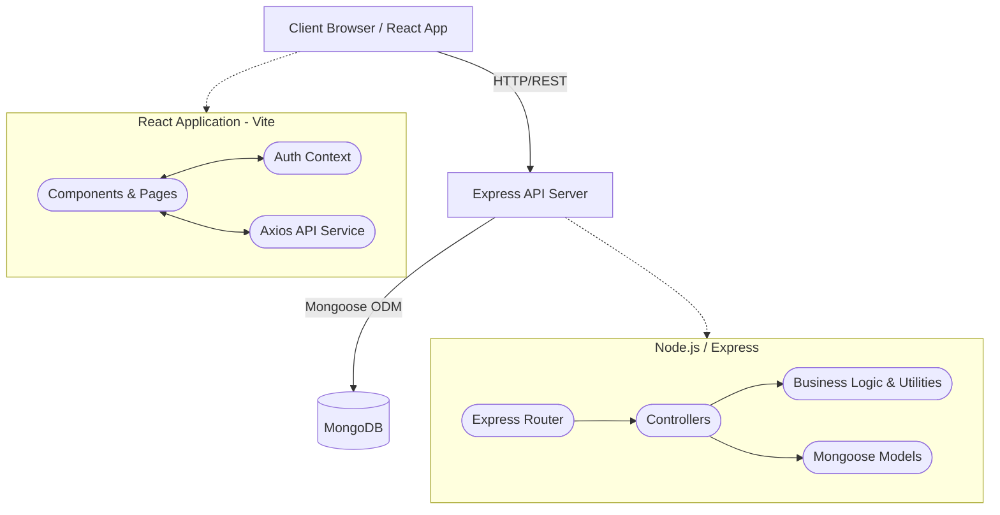

# System Architecture

## Overview
peer2peer is a Full-Stack application following a standard MERN (MongoDB, Express, React, Node.js) architecture. It utilizes a RESTful API approach for communication between the strictly decoupled frontend and backend.

## High-Level Diagram

## Component Roles

### Frontend (React + Vite)
- **State Management:** React Context API (`AuthContext`) manages user sessions comprehensively.
- **Routing:** `react-router-dom` handles page navigation and protects routes (e.g., creating a listing requires authentication).
- **Styling:** Custom CSS focusing on a clean, light, and minimalist user experience.

### Backend (Node.js + Express)
- **API Endpoints:** RESTful structured endpoints located under `/api/products` and `/api/auth`.
- **Validation:** Enforced primarily through Mongoose schema validation.
- **Authentication:** JWT (JSON Web Tokens) are generated upon login/registration and validated via middleware (`authMiddleware.js`) for protected routes.
- **Storage:** Product images are handled via Multer and stored locally in the `/uploads` directory on the server.

### Database (MongoDB)
- **Schema-Based ODM:** Mongoose enforces relationships between Users and Products (One-to-Many).
