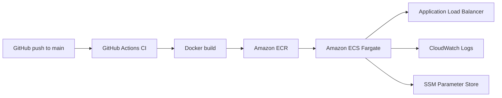

# Deployment Guide

This project now deploys as two ECS Fargate services behind one Application Load Balancer:

- `peer2peer-frontend` serves the React build from Nginx.
- `peer2peer-backend` serves the Express API and uploaded files.
- The ALB routes `/api/*` and `/uploads/*` to the backend service and everything else to the frontend service.

## Architecture



## Files

- `backend/Dockerfile`: production image for the Node.js API.
- `frontend/Dockerfile`: production image for the React app via Nginx.
- `ecs/backend-task-definition.json.template`: backend ECS task definition template.
- `ecs/frontend-task-definition.json.template`: frontend ECS task definition template.
- `scripts/aws-infra-setup.sh`: idempotent AWS bootstrap for ECR, ECS, ALB, log groups, IAM role, and SSM checks.
- `scripts/render-task-definition-template.sh`: renders the task-definition templates with the active AWS account and region.
- `.github/workflows/aws-ecs-deploy.yml`: CI/CD pipeline for build, push, and ECS deployment.

## One-time AWS bootstrap

Run the bootstrap script from the repo root after your AWS CLI is configured:

```bash
chmod +x scripts/aws-infra-setup.sh scripts/render-task-definition-template.sh
./scripts/aws-infra-setup.sh
```

The script is safe to rerun. It will:

1. Ensure both ECR repositories exist.
2. Ensure CloudWatch log groups exist with retention.
3. Ensure the ECS task execution role exists with ECR, CloudWatch Logs, SSM, and KMS decrypt access.
4. Ensure the ECS cluster exists.
5. Ensure the ALB, target groups, listener, and path-based routing exist.
6. Check or create the required SSM parameters where possible.

## Required AWS runtime secrets

These SSM parameters are expected by the backend task definition:

```bash
/peer2peer/MONGO_URI
/peer2peer/JWT_SECRET
/peer2peer/STRIPE_SECRET_KEY
```

`MONGO_URI` is the one you almost always need to supply yourself. If `JWT_SECRET` is missing, the bootstrap script generates one. If `STRIPE_SECRET_KEY` is missing, the bootstrap script creates a harmless placeholder value.

## Required GitHub secrets

For an AWS learner account, the usual path is temporary lab credentials:

- `AWS_ACCESS_KEY_ID`
- `AWS_SECRET_ACCESS_KEY`
- `AWS_SESSION_TOKEN`

Optional instead of the three above:

- `AWS_ROLE_TO_ASSUME`

Use `AWS_ROLE_TO_ASSUME` only if your learner account allows you to configure GitHub OIDC and create the IAM role trust relationship. Most learner/lab accounts do not make that easy, so the workflow also supports temporary access keys plus session token.

## Deployment flow

On every push to `main`, GitHub Actions:

1. Runs backend lint and tests plus frontend lint and build.
2. Builds both Docker images.
3. Tags each image with the commit SHA and `latest`.
4. Pushes both images to ECR.
5. Renders the ECS task definitions.
6. Updates the ECS services if they already exist.
7. Creates the ECS services on the first deployment if the ALB infrastructure already exists.

## Health checks and logging

- Backend Docker health check: `curl -fsS http://localhost:8000/health || exit 1`
- Frontend Docker health check: `wget -q -O - http://localhost/health >/dev/null 2>&1 || exit 1`
- ECS task definitions also define matching container health checks.
- Both task definitions use the `awslogs` log driver for CloudWatch.

## Important learner-account note

If your AWS credentials come from AWS Academy or another learner lab, they expire. That means the GitHub Actions deployment will stop working when the temporary credentials expire, and you will need to refresh:

- `AWS_ACCESS_KEY_ID`
- `AWS_SECRET_ACCESS_KEY`
- `AWS_SESSION_TOKEN`

This repo is now wired to reuse the existing learner-account `LabRole` as the ECS execution role, because learner accounts commonly block `iam:CreateRole`.

For a university rubric demo, that is usually acceptable as long as the workflow is working during grading.
